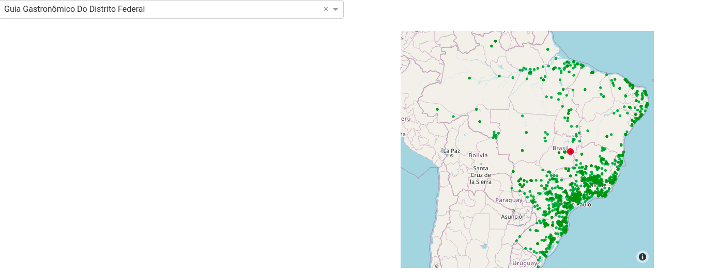

## Projeto Prospectivas para o Turismo Gastronômico no Brasil
---

> **Meta 04)** Portfólio de roteiros, experiências, eventos e festivais gastronômicos com potencial para o turismo gastronômico no Brasil e disponibilização de dados em formato integrado para ferramenta de análise visual interativa.

**Responsáveis:** Bruno Vieira Ribeiro e Ana Paula Jacques 

Para apoiar o desenvolvimento do *Programa Nacional de Turismo Gastronômico*, a **Meta 04** 
consistirá no mapeamento de pelo menos 25 roteiros, experiências, eventos e festivais gastronômicos por macrorregião no Brasil e disponibilização de dados em formato integrado para ferramenta de análise visual interativa.

# Dashboard com **Dash** em linguagem **Python**


Como ferramenta de análise visual interativa, escolhemos criar uma *Dashboard* com os dados coletados. A dashboard desenvolvida utiliza a *framework* [Dash](https://plotly.com/dash/) em linguagem **Python**. Com a facilidade de se programar diretamente em **Python** e com alta flexibilidade de customização de *layouts*, é uma ótimo ferramenta *open-source* para desenvolvimento de aplicativos de análise de dados. Da página dos criadores:


> Written on top of Flask, Plotly.js, and React.js, Dash is a user framework for creating interactive analytical web applications for data visualization in pure Python or R. It provides 100’s of charts, graphs, and UI controls, so you can build highly custom analytic apps in just a few lines of code. (...) We're strong believers that the future of technical computing and business intelligence is open source. We develop, expand, and maintain a number of open-source graphing libraries and data visualization tools for free, enabling us to amplify the collaboration and freedom inherent to open source.

## Tutoriais dos desenvolvedores

A comunidade que utiliza esta ferramenta é muita ativa e possui muitos fóruns atualizados. Existem tutoriais (para todos os níveis) disponíveis de forma gratuita no seguinte [link](https://dash.plotly.com/).

## Dados do turismo gastronômico

Este documento relata de maneira resumida o processo de *deployment* de uma *dashboard* minimalista para uma versão simplificada dos dados obtidos em [levantamento](https://www.turismogastronomico.tur.br/) disponível por tempo restrito.

Além da bibiloteca **Dash**, iremos utilizar a biblioteca *open-source* [pandas](https://pandas.pydata.org/) para análise de dados tabulares.

Os dados que usaremos estão em formato `csv` no documento `validadas.csv` e no documento `dados_mínimos.csv`, que contém apenas os nomes das iniciativas validadas.

# Criando a Dashboard

Mostramos aqui as partes que compõem o código para criar o exemplo mínimo de nossa *Dashboard*.



O necessário para reproduzir esta *Dashboard* é ter instalado *Python* versão 3.8 (ou superior) e capacidade de instalar novas dependências.

Para ter *Python* instalado corretamente basta seguir os passos na [documentação oficial](https://www.python.org/downloads/). Após instalação da linguagem **Python**, as demais dependências podem ser instaladas na linha de comando:
```
pip install [NOME_DA_DEPENDÊNCIA]
```

## Anatomia do código

O primeiro passo a se fazer em nosso código é o de *importar* todas as dependências necessárias. Isso é feito pelo comando `import` em Python (você pode usar um *apelido* ao pacote importado pelo comando **as**). Além de importar pacotes inteiros como dependências, é possível importar apenas um módulo (ou vários) de um determinado pacote completo usando a sintaxe:
```python
from [NOME_DO_PACOTE] import [MÓDULOS_A_SEREM_IMPORTADOS]
```

O nome dos módulos deve aparecer separados por vírgula.


### Importando bibliotecas (pacotes) necessárias

Em nossa *Dashboard*, precisaremos dos seguintes *imports*:

```python
import dash
import dash_bootstrap_components as dbc
import dash_html_components as html
import dash_core_components as dcc
import plotly.express as px
from dash.dependencies import Input, Output, State
import pandas as pd
import json
```

### Lendo os dados em formato `csv`

A leitura dos dados é feita utilizando-se o pacote [pandas](https://pandas.pydata.org/). Este pacote lê os dados em `csv` com a função `read_csv` e os armazena em uma estrutura de dados própria chamada `dataframe`, oq ue facilita sua manipulação.

Para a leitura dos dois arquivos `csv` que usaremos (`dados_minimos.csv` e `validadas.csv`) usamos as linhas de comando:

```python
final_df = pd.read_csv('dados_minimos.csv')
validadas = pd.read_csv('validadas.csv')
```

Armazenamos os arquivos `csv` em duas `dataframe`s:
* `dados_minimos.csv` em `final_df`
* `validadas.csv` em `validadas`

### Preparando dicionário (**Hash Table** nativa de Python) com nome das iniciativas

Para utilizar facilmente os nomes das iniciativas em listagems em nosso código, preparamos uma lista de `dicionários` mapeando o nome da iniciativa com uma chave do dicionário. Isto é feito para todas as iniciativas presentes na `dataframe` **validadas**. O código para este mapeamento se encontra a seguir

```python 
iniciativas_options = []
for ini in validadas['Iniciativa'].unique():
    my_dict = {}
    my_dict['label'] = str(ini)
    my_dict['value'] = str(ini)
    iniciativas_options.append(my_dict)
iniciativas_options = sorted(iniciativas_options, key = lambda k: k['label'])
```

### Funções definidas para plotagem em mapa

A nossa principal visualização é dada por um mapa interativo do Brasil onde são mapeadas todas as iniciativas validadas. Esta plotagem é feita com a biblioteca [plotly express](https://plotly.com/python/plotly-express/), outra ferramenta *open-source* altamente customizável e de fácil uso para gráficos complexos.

Dentre as muitas plotagens oferecidas pela biblioteca, usaremos a função `scatter_mapbox` que mapeia pontos em um mapa baseados em sua posição geográfica (latitude e longitude). Já preparamos os dados para que cada município esteja descrito por um campo de latitude e outro de longitude, o que facilita sua leitura pela biblioteca `plotly express`. A função para plotagem deste gráfico está a seguir e aceita como argumento a `dataframe` `final_df` e uma opção chamada `choice` que destaca em coloração diferente um determinado termo de busca. Note que este documento não explica os detalhes da função, pois o foco é o funcionamento e o `deployment`. Para maior entendimento da função criada por nosso grupo, sugiro a leitura da [documentação oficial do pacote plotly express](https://plotly.com/python/plotly-express/).

```python
def mapa_municipio(final_df, choice):
    '''
    Função que mapeia as iniciativas em seus respectivos pares (longitude,latitude).
    O argumento 'choice' (string) destaca em cor diferente as iniciativas que contém a string 'choice'.
    '''

    indice_escolha = final_df.index[final_df['Iniciativa'] == choice].tolist()

    seq_cores = [
        '' if (i in indice_escolha) else ' '
        for i in range(len(final_df))
    ]

    seq_sizes = [
        5 if (i in indice_escolha) else 1
        for i in range(len(final_df))
    ]

    fig = px.scatter_mapbox(
        final_df,
        lat="latitude",
        lon="longitude",
        zoom=3,
        color=seq_cores,
        color_discrete_sequence=['green', 'red'],
        size=seq_sizes,
        size_max=10,
        center={
                "lat": -15.46,
                "lon": -55.26
                },
        # mapbox_style="carto-positron",
        mapbox_style="open-street-map",
        hover_name='Iniciativa',
        hover_data={
            'latitude': False,
            'longitude': False,
            'Município': True,
            'Estado': True
        },
        width=650,
        height=600)

    fig.layout.update(showlegend=False)
    fig.update_traces(
        hovertemplate=
        '<b>%{hovertext}</b><br><br>Município=%{customdata[2]}<br>Estado=%{customdata[3]}<extra></extra>'
    )

    return fig
```
### Início do aplicativo web que contém a Dashboard

A biblioteca `Dash` gera uma aplicação web usando como base a biblioteca `Flask` (em Python). Para iniciar a aplicação, devemos declarar um nome para a aplicação. Usaremos o nome `app` e o tema **CERULEAN** para a parte visual (mais temas gratuitos podem ser encontrados [neste](https://bootswatch.com/) link.)

Para iniciar o *app*, usamos a seguinte linha de código

```python
app = dash.Dash(__name__, external_stylesheets=[dbc.themes.CERULEAN])
```

### Corpo principal do **app** (seu *layout*)

Toda a página de nosso *app* estará contida em uma `Div` da linguagem *HTML*. A *Div* principal é criada dentro do `app.layout` como
```python
app.layout = html.Div()
```

Dentro de `html.Div()`, povoamos a página com nosso conteúdo. Neste exemplo mínimo, criaremos um única linha de página (`dbc.Row()`) contendo duas colunas (`dbc.Col()`).

Na primeira coluna colocaremos nossa lista de iniciativas validadas dentro de uma listagem de escolha (menu *Dropdown*). Isto é feito pela função `dcc.Dropdown()` passando como argumentos
* uma `id` para identificar o elemento,
* a lista de dicionários criada acima no parâmetro `options`
* a cor (em formato hexedecimal) do texto no parâmetro `style`
* o valor inicial a ser mostrado no parâmetro `value`
* o valor a ser mostrado caso nenhuma opção seja selecionada pelo usuário no parâmetro `placeholder`
* a altura que cada opção pode ocupar dentro do menu no parâmetro `optionHeight`.

Na segunda coluna, mostramos o mapa com as iniciativas em destaque. Um gŕafico é criado como uma `figure` dentro da função `dcc.Graph()`. Esta função tem sua própria `id` para identificar o elemento (essas `id`s permitem fazer a conexão entre o menu `Dropdown` e o gráfico).

Em código, esta `layout` fica no formato seguinte:
```python
app.layout = html.Div([
    
    dbc.Row([
        dbc.Col([
            # Lista em dropdown das diferentes iniciativas cadastradas
            dcc.Dropdown(id='escolha-ini',
                                options = iniciativas_options,
                                style={'color': '#000000'},
                                value = 'Guia Gastronômico Do Distrito Federal',
                                placeholder = 'Busca por iniciativa...',
                                optionHeight = 60
                                ),
        ]),
        dbc.Col([
            # Espaço para plotar o mapa usando a função mapa_municipio()
            dcc.Graph(id='mapa-por-mun')
        ])
    ])
])
```

### Função callback para conectar menu `Dropdown` com o gráfico

Na biblioteca *Dash*, a interação entre diversos elementos da aplicação se dá por meio de funções especiais chamadas de `callbacks`. Estas funções são iniciadas com a linha `@app.callback()` e podemos identificar, usando as `id`s dos elemntos criados, quais serão os `inputs` e quais serão os `outputs` da interação.

Em nosso caso, queremos que o `input` seja a iniciativa selecionada pelo menu `Dropdown` (`id`: `escolha-ini`) e o `output` seja o gráfico atualizado (`id`: `mapa-por-mun`).

A função `callback` é escrita na forma seguinte
```python
@app.callback(
    Output("mapa-por-mun", "figure"),
    Input("escolha-ini", "value")
)
def plota_mapa_mun(ini):
    return mapa_municipio(final_df, ini)
```

## Finalizando a aplicação e rodando em servidor local

Nossa aplicação está completa neste ponto. Precisamos dizer ao programa que rode o código em servidor local.

Isso é facilmente feito com as linhas abaixo:
```python
if __name__ == '__main__':
    app.run_server()
```

## Fazendo o deploy no [Heroku](https://www.heroku.com/)

Heroku é um [PaaS](https://pt.wikipedia.org/wiki/Plataforma_como_servi%C3%A7o), *Plataforma como serviço*. Isso significa que você pode fazer *deploy* de seus serviços sem se preocupar (ao menos inicialmente) com configurações de hardware e sistema operacional.

Você só precisa se focar na aplicação e nos componentes de infraestrutura necessários.

Para fazer o *deploy* da aplicação que acabamos de construir, precisamos de duas instalações leves:
* Uma conta no **Heroku** e sua *CLI* (*Command Line Interface**)
* [git](https://git-scm.com/)

### Passo 1 - Instalando Heroku e Git

1. Crie uma conta (gratuita) no Heroku com o link (https://signup.heroku.com/dc)

2. Faça o *login* na sua conta Heroku. Após o login você deve estar na página https://dashboard.heroku.com/apps .

3. Clique na opção **Python**. Na próxima página, selecione **Set Up**. Uma opção deve aparecer para fazer o download da **Heroku Command
Line Interface (CLI)**. Escolha seu sistema operacional e siga as instruções para instalação. Deve aparecer a opção de instalr o **Git** também, selecione esta opção.

4. Se o **git** *não foi instalado* com a **CLI** do Heroku, você pode fazer o download diretamente de https://git-scm.com/downloads e seguir as instruções para o seu sistema operacional.

### Passo 2 - Instale `virtualenv`

Se ainda não o fez, instale o pacote `virtualenv` com o comando 
```​
pip install virtualenv

```
em seu terminal. Ambientes virtuais (ou `virtualenvs`) permitem criar ambientes isolados com o Python e todas as dependências que nossa aplicação requer. Isto inclui as versões de python, Dash, Plotly... que você usou. Assim, quando novas versões forem publicadas a nossa aplicação não precisa ser modificada!

### Passo 3 - Crie uma pasta para desenvolvimento

Crie uma pasta para o projeto. Isto conterá uma cópia *de desenvolvimento* da sua aplicação. Você pode criar manualmente esta pasta em qualquer local de seu computador, mas pelo terminal basta criar:
```
mkdir nome_da_pasta
cd nome_da_pasta
```

A primeira linha cria a pasta e a segunda navega até ela.

### Passo 4 - Inicialize o Git

Inicialize um repositório git vazio:
```
git init
```

**FAÇA ISSO DENTRO DA PASTA DE DEENVOLVIMENTO**. Este comando deve ser executado no terminal dentro da pasta criada no passo anterior.

### Passo 5 (WINDOWS) - Crie, ative e povoe seu ambiente virtual

* Crie o ambiente virtual. Chamaremos o nosso de `venv`, mas pode escolher qualquer nome:

```
​python -m virtualenv​ venv
```

* Ative o ambiente virtual

```
.\​venv​\Scripts\activate
```

* Instale o Dash e todas as dependências que usaremos:
```
pip install dash
pip install dash_bootstrap_components
pip install dash_html_components
pip install dash_core_components
pip install plotly
pip install pandas
pip install json
```
 Cada linha acima deve ser executa individualmente.

 * Instale uma nova dependência chamada [gunicorn](https://gunicorn.org/) para o *deploy* do *app*:
 ```
pip install gunicorn
 ```

 ### Passo 5 (macOS/Linux) - Crie, ative e povoe seu ambiente virtual

 * Crie o ambiente virtual. Chamaremos o nosso de `venv`, mas pode escolher qualquer nome:

```
​python3 -m virtualenv​ venv
```

* Ative o ambiente virtual

```
​ source ​venv​/bin/activate
```

* Instale o Dash e todas as dependências que usaremos:
```
pip install dash
pip install dash_bootstrap_components
pip install dash_html_components
pip install dash_core_components
pip install plotly
pip install pandas
pip install json
```
 Cada linha acima deve ser executa individualmente.

 * Instale uma nova dependência chamada [gunicorn](https://gunicorn.org/) para o *deploy* do *app*:
 ```
pip install gunicorn
 ```

 ### Passo 6 - Adicione arquivos à pasta de desenvolvimento

 Os seguintes arquivos devem estar dentro da sua pasta de desenvolvimento:
 * `mwe.py`: o código com a aplicação
 * `.gitignore`: usado pelo *git* para ignorar arquivos desnecessários à produção
 * `Procfile`: para o *deployment*
 * `requiremnts.txt`: lista das dependências (criaremos automaticamente)
 * `dados_minimos.csv` e `validadas.csv`: nossos dados.

 1- `mwe.py`: sua construção foi descrita anteriormente mas, agora, para rodar em servidor externo, precisamos acrescentar a linha `server = app.server` logo após criar a variável `app`:

 ```python
app = dash.Dash(__name__, external_stylesheets=[dbc.themes.CERULEAN])

server = app.server
```

2- `.gitignore`: o arquivo deve conter apenas o texto a seguir:

```
venv
*.pyc
.DS_Store
.env
```

3- `Procfile`: o arquivo deve conter apenas o texto a seguir:

```
web: gunicorn mwe:server
```

O nome `mwe` se refere ao nosso arquivo `mwe.py`. Se você modificou o nome do arquivo, modifique aqui também.

4- `requirements.txt`: este arquivo pode ser gerado automaticamente no terminal com o comando

```
​ pip freeze > requirements.txt
```

Em nosso caso, o arquivo deve conter o seguinte:

```
Brotli==1.0.9
click==8.0.1
dash==2.0.0
dash-bootstrap-components==0.13.0
dash-core-components==2.0.0
dash-html-components==2.0.0
dash-table==5.0.0
Flask==2.0.1
Flask-Compress==1.10.1
gunicorn==20.1.0
importlib-metadata==4.8.1
itsdangerous==2.0.1
Jinja2==3.0.1
MarkupSafe==2.0.1
numpy==1.21.2
pandas==1.3.3
plotly==5.3.1
python-dateutil==2.8.2
pytz==2021.1
six==1.16.0
tenacity==8.0.1
typing-extensions==3.10.0.2
Werkzeug==2.0.1
zipp==3.5.0
```

**RECOMENDAÇÂO: rode o seu próprio pip freeze! Estas dependências foram geradas no momento da criação do app para teste e podem mudar dependendo do seu tipo de instalação.**

### Passo 6 - Entre a sua conta Heroku

No terminal, faça o *login* usando as credenciais que criou no passo 1:

```
heroku login
```

Após executar este comando você deverá informar o e-mail cadastrado e a correspondente senha.

### Passo 7 - Inicialize o Heroku, adicione arquivos ao Git e faço o Deploy

No terminal, **com o ambiente virtual ativado**:

```
​heroku create meu-app
```

Mude o nome `meu-app` para um nome único que deseja mostrar na navegação até sua aplicação (apenas letras minúsculas, numeros e `-`).

```
git add .
```
Isto adiciona todos os arquivos ao git (exceto aqueles listados no `.gitgonre). **REPARE O PONTO (.) NO FIM DA LINHA DE COMANDO.

```
git commit -m "Lançamento inicial"
```
Todo `commit` deve vir acompanhado de uma mensagem descritiva.

```
git push heroku master
```
Este é o comando que faz o `deploy` do código como está. A primeira vez que executar o `push` pode demorar um pouco.

```
heroku ps:scale web=1
```
Isto roda seu `app` com um "dyno" do heroku.

### Passo 8 - Visite sua aplicação na Web!

Você, neste ponto, deve ser capaz de visitar seu `app` no sítio ​ https://meu-app.herokuapp.com.
(mude o nome **meu-app** pelo nome escolhido).

### Passo 9 - Atualize seu `app`

Se você deseja atualizar sua aplicação ou acrescentar bibliotecas às suas dependências, você deve seguir os passos a seguir:

* Se instalando novas dependências:
```
pip install [NOVA_DEPENDÊNCIA]
pip freeze > requirements.txt
```

* Se atualizando dependência já existente:
```
pip install [NOVA_DEPENDÊNCIA] --upgrade
pip freeze > requirements.txt
```

* Em todos os casos
```
​git status​ ​ # ver mudanças (opcional)
git add .​ ​ # incluir todas as mudanças
git commit -m ​ "descrição das mudanças"
git push heroku master
```
